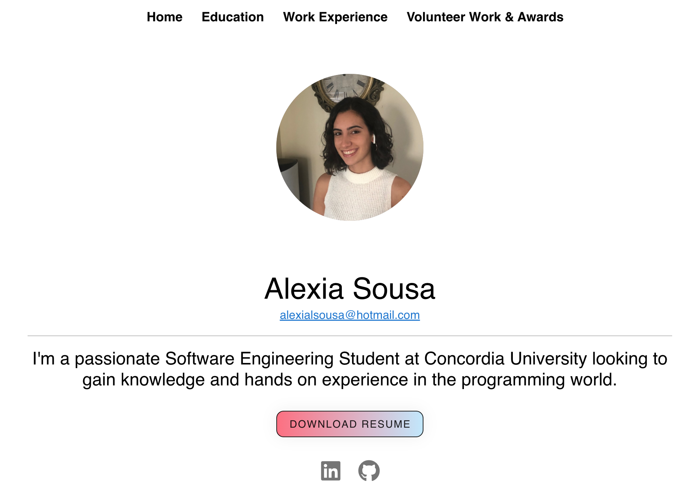

# Hi there 👋, I'm Alexia

 

I'm currently in my last year of my Software Engineering degree at Concordia University in Montreal, Quebec. With graduation fast approaching, I'm searching for some amazing full time opportunities in software development.

 

## 📫 Connect with me!
  

 

## ⚙️ Languages and Tools: 

                   

 

## [Check out my Website](https://alexiasousa.netlify.app/) 

 

